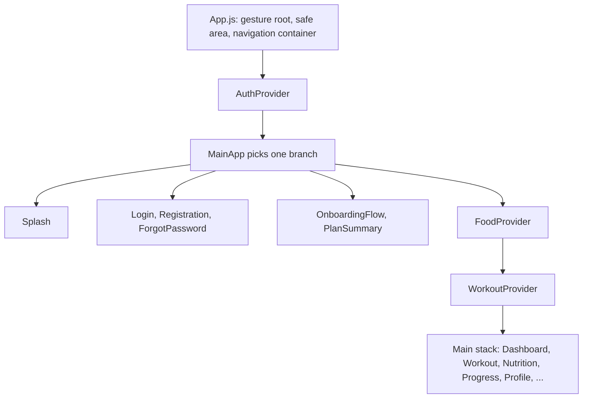

# Uptrack: guide for coding agents

Uptrack is an Expo / React Native app for tracking nutrition, weight and workouts. Firebase holds user data. Supabase holds the shared food database. `readme.md` is the user-facing readme. This file is for agents working on the code.

| Short | Stands for | In one line |
|---|---|---|
| EAS | Expo Application Services | Expo's cloud builds, environment variables and over-the-air updates |
| RLS | Row-level security | Per-row Postgres access rules that Supabase enforces |
| PostgREST | | The REST layer Supabase puts in front of Postgres; filters travel in the URL |
| CNG | Continuous native generation | `android/` and `ios/` are generated from `app.config.js` and are gitignored |

## Stack

- Expo SDK 54, React Native 0.81.5 (new architecture on Android), React 19.1.
- React Navigation 6 with a single native stack. There is no tab navigator.
- Firebase JS SDK 10.14.1: Auth (email and password, plus Google), Firestore, Storage.
- Supabase JS v2 with the anon key, for food search and barcode lookup.
- Health data: `react-native-health` (iOS HealthKit) and `react-native-google-fit` (Android).
- Jest 29 with babel-jest. TypeScript ~5.9 with `allowJs`; most of the app is still JavaScript.
- One patch-package patch, `patches/react-native+0.81.5.patch`. It makes the Event phase constants writable.

## Commands

| Command | Purpose |
|---|---|
| `npm ci --legacy-peer-deps` | Install. `postinstall` applies the patch. |
| `npx jest` | Unit tests |
| `npx tsc --noEmit` | Type check |
| `npx expo config --type introspect --json` | Resolved config after plugins (Info.plist, entitlements, manifest) |
| `npx expo export --platform android --output-dir <temp dir>` | Builds the JS bundle. Catches import and syntax errors without a native build. |

`npm start` runs `expo start --dev-client`, which needs a dev-client build on the device. `npm run android` and `npm run ios` load `.env.dev` through dotenv-cli. Environment files are gitignored. Never print their values.

CI (`.github/workflows/tests.yml`) runs the install, Jest and `tsc` on Node 22 for pushes and pull requests to `master`.

### Hooks lint

The repo has no ESLint config on purpose. Do not add one unless the owner asks. To check the React hook rules, install `eslint@9`, `eslint-plugin-react-hooks@5` and `@typescript-eslint/parser` in a scratch directory outside the repo, and save this there as `eslint.config.mjs`:

```js
import reactHooks from 'eslint-plugin-react-hooks';
import tsParser from '@typescript-eslint/parser';

const rules = {
  'react-hooks/rules-of-hooks': 'error',
  'react-hooks/exhaustive-deps': 'warn',
};

const languageOptions = {
  ecmaVersion: 'latest',
  sourceType: 'module',
  parserOptions: { ecmaFeatures: { jsx: true } },
};

export default [
  { files: ['**/*.js'], languageOptions, plugins: { 'react-hooks': reactHooks }, rules },
  { files: ['**/*.ts', '**/*.tsx'], languageOptions: { ...languageOptions, parser: tsParser }, plugins: { 'react-hooks': reactHooks }, rules },
];
```

Run it from the repo root:

```powershell
node <scratch>/node_modules/eslint/bin/eslint.js -c <scratch>/eslint.config.mjs "src/**/*.js" "src/**/*.ts" "src/**/*.tsx" App.js
```

Baseline on `master`: 0 rules-of-hooks errors and 38 exhaustive-deps warnings. A change must not add any.

## Layout

```text
App.js                 providers and the single stack navigator
app.config.js          Expo config: plugins, permissions, env-driven extra
plugins/               local config plugin withGoogleFitVersions
patches/               patch-package patches
src/features/<area>/   auth, dashboard, nutrition, profile, progress, workout
  components/, screens/      UI
  context/                   React context providers
  handlers/, services/       Firestore and Supabase access
  helpers/, utils/           hooks and pure logic; most tests live here
src/shared/            theme, shared components and hooks, supabaseClient, types.ts
docs/                  design notes
audit/                 temporary: October 2026 audit findings and fix plan
```

## How the app fits together



- Arrows mean "renders". `MainApp` (in `App.js`) shows exactly one branch: Splash while auth loads, the sign-in screens when signed out, onboarding until `profileSetupComplete`, otherwise the main stack.
- `AuthProvider` is `src/features/auth/context/AuthContext.tsx`. Its auth listener loads `users/{uid}`, fills in profile defaults, and clears device-wide caches on sign-out.
- `FoodProvider` (`nutrition/context/FoodContext.js`) owns the selected date and the day's meals (through `mealService.ts` and `MealCache.ts`). It applies writes to the screen first and rolls them back if the save fails. It also handles daily totals, step sync and the weekly calorie evaluation.
- `WorkoutProvider` (`workout/context/WorkoutContext.js`) loads workout history and templates and restores the active workout. Screens call `workout/handlers/WorkoutHandler.js` directly for splits, templates and exercises.
- The food and workout providers live inside the main stack, so their React state resets on sign-out. Module-level singletons such as `workoutService` do not.

Route names are plain strings with no typed param list. Check that a route is registered in `App.js` before navigating to it. `BatchScanResults` is still unregistered (BUG-11).

## Data

Firestore. Every user-data query filters on a `uid` field or uses a uid-based document ID.

| Collection | Document ID | Contents |
|---|---|---|
| `users` | uid | Profile, plan targets, `weightIns`, `dailySteps`, `weeklyNutrition`, `activeSplitId`. Many modules write here with `setDoc(..., { merge: true })`. |
| `meals` | `{uid}_{YYYY-MM-DD}`, local date | One document per day |
| `workoutHistory` | auto | Finished workouts, `uid` field |
| `workoutTemplates` | `{templateName}_{uid}` | `uid` field |
| `workoutSplits` | auto | `uid` field. `schedule` is keyed by weekday names, or `"1"` to `"n"` for rotation splits. |
| `measurements` | auto | `uid` field |
| `exercises` | muscle group | Shared catalog. Custom exercises are currently written into it (SEC-02). |

Storage holds profile pictures at `profilePictures/{uid}.jpg`.

Supabase, through the anon key:
- `non_barcoded_products`: text search, plus the `search_products_similarity` RPC.
- `barcoded_products`: barcode lookup. The custom food screen also inserts into it (SEC-04).
- `NutritionHandler.js` quotes search terms before putting them in PostgREST `or()` filters. Keep it that way.

AsyncStorage:

| Key | Scope |
|---|---|
| `meal_cache_v2_{uid}`, `user_{uid}`, `home_*_{uid}` | Per user |
| `cached_splits`, `@food_recent_searches`, `@recent_searches` | Device-wide, removed on sign-out in `AuthContext.tsx` |
| `exercises_cache_v2`, `exercise_images_cache` | Device-wide copy of the shared catalog |
| `activeWorkout` | Device-wide and never cleared, so it leaks across accounts (SEC-07) |
| `auth_token` | Holds the uid. Written, never read. |

New per-user data needs the uid in its key, or an entry in the sign-out `multiRemove` in `AuthContext.tsx`.

`app.config.js` copies environment variables into `extra`: the Firebase web config, the Supabase URL and anon key, the Google client IDs and `DEFAULT_FOOD_ICON_URI`. Code reads them through `Constants.expoConfig.extra`. Everything in `extra` ships inside the app, so only public values belong there.

## Conventions

- Match the surrounding code. No comments unless they state a constraint the code cannot show. No emojis anywhere, including strings.
- Short names where idiomatic (`i`, `e`, `el`). No drive-by refactors or style churn.
- Confirm a bug by reading the code, and by running something when possible, before editing it.
- One logical change per commit. The message says what was broken for the user and why the fix is safe.
- If a change turns on code that has never run in production, such as a button that had no handler, say so in the commit message.
- Behavior changes that need a product call go to the owner as a question, not into a commit.
- Do not push, force-push or open pull requests unless the owner asks. Never print secrets.

TypeScript:
- Convert files with `git mv` so `git log --follow` keeps their history.
- Shared shapes live in `src/shared/types.ts`. Import them. Never redeclare a type locally.
- No `any`, `@ts-ignore` or `@ts-expect-error`. Firestore data is cast where it enters (`snap.data() as MealDayDoc`) until typed converters exist.
- `firebaseConfigService.js` stays JavaScript. TypeScript resolves the web `firebase/auth` types, which lack `getReactNativePersistence`.

Dates:
- Day keys are local `YYYY-MM-DD` strings from `formatDate` in `src/features/nutrition/utils/dateUtils.ts`.
- Do not build day keys with `toISOString()`, which is UTC. Do not parse `'YYYY-MM-DD'` with `new Date()`, which gives UTC midnight. Both shift the day for users away from UTC.
- Weeks start on Monday.

## Testing

- Jest only runs tests in the folders listed in `testMatch` in `jest.config.js`: `profile/utils`, `nutrition/helpers`, `nutrition/handlers`, `nutrition/services`, `progress/utils` and `workout/utils`. A test anywhere else never runs. Add its folder to `testMatch`.
- Tests run in Node and mock `firebase/*`, `firebaseConfigService`, AsyncStorage and the Supabase client with `jest.mock`.
- There is no component or navigation test setup. Screen changes are checked by reading the code, `tsc`, the hooks lint and the Android bundle build. Say so when reporting.
- For date logic, also run Jest in another time zone. CI runs in UTC. In PowerShell: `$env:TZ = 'America/Los_Angeles'; npx jest`.

## Gotchas

- PowerShell `>` writes UTF-16. Use `git diff --output=<file>` or `Out-File -Encoding utf8` for patches and logs.
- The weekly evaluation writes calorie and macro targets to `users/{uid}`. It runs at app start (`FoodContext.js`) and after the first weigh-in of a new week (`weightTrackerUtils.ts`), at most once every 6 days, and never when `autoAdjustEnabled === false`. Read the notes in `audit/PLAN.md` before changing it.
- `workoutService` (`WorkoutService.js`) is a singleton. Its in-memory workout survives sign-out.
- Native configuration goes through `app.config.js` or `plugins/`, never through edits to generated `android/` or `ios/` folders.

## Open work

`audit/` holds the October 2026 audit: `FINDINGS.md` lists every finding and its status, and `PLAN.md` is the fix plan. The directory is temporary. The owner will delete it once the plan is done.
