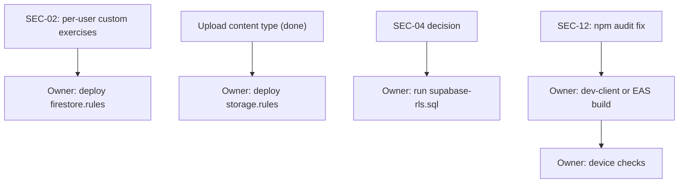

# Fix plan

This plan is for the next agent working on the October 2026 audit findings. Read `AGENTS.md` first. IDs match `FINDINGS.md`. Line numbers were checked against `master` on 2026-10-10 and will drift.

## Ground rules

- Confirm each problem in the current code before editing. Run something when you can.
- Items marked **decision** need the owner's answer first. Propose the recommended option; do not implement it unasked.
- One logical change per commit. After each batch run `npx jest`, `npx tsc --noEmit` and the hooks lint (baseline: 0 errors, 38 warnings).
- When logic is testable, add a Jest test in a folder that `testMatch` covers, or add the folder.
- Say in the commit message when a change turns on code that has never run in production.
- Do not deploy rules, run SQL or change console settings. Those are owner tasks.
- Do not push unless asked.

## Owner tasks

1. **SEC-01:** rotate the Supabase service-role key and delete `SUPABASE_SERVICE_ROLE_KEY` from EAS. Check whether any build or update made between 2025-11-19 and 2026-10-10 had it set.
2. **SEC-05:** export the current Firestore and Storage rules from the console and compare them with `rules/`. Test in the Rules Playground or the emulator, then deploy. `firestore.rules` denies all writes to `exercises`, so finish SEC-02 first or custom exercises stop working.
3. **SEC-04:** check whether RLS is on for `non_barcoded_products` and `barcoded_products`. Run `rules/supabase-rls.sql` once the insert decision is made. Its insert policy matches the columns that `transformForBarcodeDB` writes.
4. **Builds:** an iOS dev-client or EAS build to confirm HealthKit steps (BUG-26), and an Android build after SEC-12.
5. **Device checks** for paths that never ran in production:
   - "Create Custom Food" in empty search results (BUG-17).
   - Active on the current split (BUG-22).
   - Recent search Clear and remove (BUG-29).
   - The weekly evaluation at app start.
6. Optional: check whether Firebase Auth email enumeration protection is on. SEC-10 is fixed in code either way.

## Decisions to collect

| ID | Question | Recommended |
|---|---|---|
| SEC-02 | Where do custom exercises live? | A top-level `customExercises` collection with a `uid` field, the same pattern as templates and splits |
| SEC-03 | Enforce email verification for password accounts? What about existing unverified accounts? | Enforce it, and add "resend verification email" on Login so existing accounts can verify |
| SEC-04 | Keep anonymous inserts into `barcoded_products`? | Keep them under the validation policy for now. Move to a moderated table if junk rows appear. |
| SEC-07 | Key `activeWorkout` by uid, or clear it on logout? | Key by uid. Delete the legacy key, since its owner cannot be known. |
| SEC-09 | Switch to `verifyBeforeUpdateEmail`? | Yes |
| SEC-12 | Run a non-force `npm audit fix`? | Yes, then a build |
| Weekly eval | Keep the app-start trigger? | Keep it only with a "new snapshot" guard (see the notes at the end) |
| BUG-11 | Batch scan: build it or remove it? | Remove it |
| BUG-12 | Turn on workout notifications? | Owner call. Never-run code. |
| BUG-13 | Which rotation day is "today"? | Store `rotationStartDate` on activation; day = whole days since start mod n, plus 1 |
| BUG-14 | After deleting the active split, clear or reassign? | Clear it; every screen already falls back to the first split |
| BUG-15 | Unit change: convert the amount or keep the number? | Convert between `g` and `oz`, and between `mL` and `cup`. Reset to 1 for `serving`. |
| BUG-16 | Macro bars without targets: estimate or hide? | Remove the override and never show 100% for a zero target |
| BUG-23 | ChangePassword: link it or remove it? | Link it from Profile for password accounts only |

## Order of work

- Boxes are tasks. An arrow means "do this first".
- "Owner" boxes are console, build or device work that an agent cannot do.
- SEC-01 (rotate the key) depends on nothing. Do it now.

## Tasks, in priority order

### 1. SEC-07: active workout leaks across accounts (Medium, decision)

- **Where:** `WorkoutService.js:65-118` (persist, restore and clear use the device-wide `activeWorkout` key). `WorkoutContext.js:61-75` (auth listener). `StartWorkout.js:272-281` (when nothing is restored, it starts from the singleton's in-memory exercises).
- **Problem:** user A starts a workout and signs out. User B signs in on the same device and gets A's workout, either from storage or from memory. Finishing saves it under B's uid.
- **Steps:**
  1. Give `WorkoutService` a `uid` and a `storageKey()` that returns `activeWorkout_${uid}`.
  2. Add `async setUser(uid)`:
     - If the uid is unchanged, return.
     - If a persist is pending, clear the timer and persist under the old key.
     - Reset the exercises, start time, note, template name and `lastSetCache`, then store the new uid.
     - Remove the legacy `activeWorkout` key. The saved state has no uid, so its owner is unknown.
     - Notify listeners.
  3. Make persist, restore and clear use `storageKey()`. With no uid, persist does nothing and restore returns null.
  4. Call `workoutService.setUser(user?.uid ?? null)` in the `WorkoutContext` auth listener, before `checkActiveWorkout()`, in both branches.
- **Tests:** add `workout/services` to `testMatch`. Mock AsyncStorage and `../handlers/WorkoutHandler`. Cover these cases:
  - B never restores A's workout.
  - A's pending persist lands under A's key.
  - `setUser` with the same uid keeps memory.
  - The legacy key is removed.
- **Done when:** B never sees A's workout, and A gets it back after signing in again.
- **Owner note:** anyone mid-workout during the upgrade loses that unfinished workout.

### 2. SEC-02: custom exercises overwrite the shared catalog (High, decision)

- **Where:** `WorkoutHandler.js:648-708` (`createCustomExercise` reads `exercises/{muscleGroup}`, appends, and writes the whole array back with `setDoc`). The catalog loader and its `exercises_cache_v2` cache start around `WorkoutHandler.js:416`.
- **Problem:** every user's custom exercises show up for everyone, concurrent adds lose data, and the rules must let any user rewrite the catalog.
- **Steps:**
  1. Write custom exercises to `customExercises/{auto}` with `uid`, keeping the duplicate-name check against the catalog and the user's own exercises.
  2. Load the user's custom exercises (`where('uid', '==', uid)`) and merge them into the catalog by muscle group. Keep the catalog cache device-wide, but do not put custom exercises in it.
  3. Add a `customExercises` block to `rules/firestore.rules`. Use read and delete with `ownsDoc()`, create with `claimsDoc()`, and update with `ownsDoc() && keepsOwner()`.
  4. Migration, run by the owner with the Admin SDK: move catalog entries with `isCustom: true` into `customExercises`, using `createdBy` as `uid`, then strip them from the catalog docs.
  5. Keep the BUG-09 behavior: ExerciseSelection reloads after CreateExercise.
- **Tests:** make the merge a pure function in `workout/utils` and test it.
- **Done when:** two accounts don't see each other's custom exercises, and `firestore.rules` can deny all writes to `exercises`.

### 3. SEC-03: email verification is not enforced (Medium, decision)

- **Where:** `firebaseAuthService.js:19-32` (sign-in throws after signing in, without signing out), `:34-51` (sign-up leaves the user signed in), `AuthContext.tsx:76-97` (the listener accepts any user).
- **Problem:** a new password account is signed in as soon as it registers, and the listener takes it straight to onboarding.
- **Steps:**
  1. In the listener, treat a user whose `providerData` includes `password` and whose `emailVerified` is false as signed out. Do not call `signOut` from the listener. Sign-up is still writing `users/{uid}` at that moment, and the write needs auth.
  2. In sign-up, call `signOut` after `sendEmailVerification`.
  3. In sign-in, call `signOut` before throwing the "not verified" error.
  4. On Login, add "resend verification email": sign in, `sendEmailVerification`, sign out.
- **Done when:** a new password account cannot reach onboarding until it is verified, and Google sign-in is unchanged.

### 4. SEC-04: anonymous inserts into `barcoded_products` (Medium, decision)

- **Where:** `useCustomFood.js:102-128` (existence check, then `insert` at 120-122).
- **Options:** (a) keep the inserts under the validation policy in `rules/supabase-rls.sql`, (b) insert into a separate table that the owner reviews, (c) store user-created barcoded foods per user in Firestore.
- **Code work:** none for (a). For (b) or (c), change the insert and the lookup in `NutritionHandler.js`.

### 5. SEC-09: email change without verification (Low, decision)

- **Where:** `ProfileScreen.js:130-160` (`updateEmail` at 138, Firestore write at 152).
- **Steps:**
  1. Use `verifyBeforeUpdateEmail` and tell the user to open the link.
  2. In the auth listener, copy `auth.currentUser.email` to `users/{uid}.email` when they differ.
  3. Handle `auth/requires-recent-login`.

### 6. SEC-12: dependencies (Low, decision)

- **Steps:**
  1. Run `npm audit fix` without `--force`. Force proposes major downgrades.
  2. Run `npx expo install --check`, then the test suite.
  3. Remove `expo-auth-session` with `npm uninstall`. It is listed at `package.json:27` and never imported.
  4. The owner then makes a build.

### 7. Weekly evaluation guard (decision)

- See the notes at the end. If the owner keeps the app-start trigger, store the newest snapshot's `weekStart` as `lastEvaluatedWeek` whenever an evaluation runs, and skip when no newer snapshot exists.
- **Tests:** in `learningCompletionService.test.js`, cover "no new snapshot, no adjustment" and "new snapshot, evaluates".

### 8. BUG-13: rotation splits show as rest days (Medium, decision)

- **Where:** `WorkoutScreen.js:514-529` (today and upcoming use weekday keys), `ProgramItem.js:13-24` (lists weekday keys only), `PreviewSplitScreen.js:49, :69` (sorts numeric keys, counts keys). Also check how Dashboard and `countPlanned` in ProgressScreen read schedules.
- **Steps:**
  1. Write a helper `getScheduledDay(split, date)` in `workout/utils`, with tests for weekly and rotation splits.
  2. Use it everywhere that picks today's workout.
  3. Make n the highest day number, not the key count.
  4. Store `rotationStartDate` when a rotation split is activated: in `WorkoutLibraryScreen.handleActivateSplit` and in PreviewSplit's activate.
- **Done when:** a rotation split shows the right workout today and in the upcoming list, and weekly splits are unchanged.

### 9. BUG-14: deleting the active split (Low, decision)

- **Where:** `WorkoutProgramLibrary.js:30-51`, `WorkoutLibraryScreen.js:109-136`.
- **Steps:** after deleting the active split, write `activeSplitId: deleteField()` with merge to `users/{uid}`, call `refreshUserData`, and set the local `activeSplitId` to the first remaining split or null.
- **Done when:** Library, Dashboard and Workout agree after the delete.

### 10. BUG-11: batch scan (Medium, decision)

- **Where:** `useBarcodeScanner.js:79-92` (duplicate check on `barcode_id`), `:195-212` (toggle, then navigate to the unregistered `BatchScanResults`), `BarcodeScannerScreen.js:169` (toggle UI).
- **Recommended:** remove batch mode: the toggle, its state and the handler.
- **To keep it instead:** build and register the results screen, and compare products on a field that survives the transform.

### 11. BUG-12: workout notifications (Medium, decision)

- **Where:** `StartWorkout.js:48-62` (`update`), `:284` (`init` only), `WorkoutNotificationService.js:16-48`.
- **If yes:**
  1. Call `start()` when a workout starts or is restored, and remove it when the workout is finished or discarded.
  2. Show the current exercise. `updateNotification` always uses `exerciseData[0]` (`StartWorkout.js:50`), so the notification would name the first exercise all session. The first exercise with an unvalidated set needs no new state.
  3. Check the Android 13+ notification permission and the channel.
  4. Test on a device.
- **If no:** stop calling `init()`. It asks for notification permission for nothing.

### 12. BUG-16: macro bars (Low, decision)

- **Where:** `MacroProgresBar/MacroProgressBar.js:22`.
- **Steps:**
  1. Delete the `hasTargets = true` override.
  2. Check what each caller passes for `hasTargets`.
  3. Make sure a zero `maxValue` never renders as 100%.
- Turning on the estimate path runs code that has never run in production.

### 13. BUG-15: unit change keeps the number (Low, decision)

- **Where:** `FoodDetailScreen.js:62-66`, units `['g', 'oz', 'mL', 'cup', 'serving']` at line 21.
- **Steps:** convert the quantity inside compatible units (`g` and `oz`, `mL` and `cup`). Check how nutrients scale with the unit before choosing the factor for `serving`.

### 14. BUG-23: ChangePassword is unreachable (Low, decision)

- **Where:** `App.js:58`, `ChangePasswordScreen.js:17-33`.
- **Steps:** link it from Profile only when `providerData` includes `password`. Otherwise remove the screen and its route.

### 15. BUG-18: setup marked complete after a failed refresh (Low)

- **Where:** `PlanSummaryScreen.js:59-75`, `AuthContext.tsx:59-73`.
- **Steps:** `const data = await refreshUserData();`. If `data` is undefined, show an error, call `setSaving(false)` and return. The plan is already saved, so retrying only needs the refresh.

### 16. BUG-20: Profile form does not resync (Low)

- **Where:** `ProfileScreen.js:43-62`.
- **Steps:** when `userData` changes and the form has no unsaved changes, reset `form`, `original`, `identity`, `savedIdentity` and `picture` from it.

### 17. BUG-24: MealItem memo comparator (Low)

- **Where:** `MealItem.js:63-83`.
- **Steps:**
  1. Confirm that FoodContext replaces a food object when it changes.
  2. Then compare `prev.food === next.food`, plus the handlers and flags.
  3. If the parent creates new handlers on every render, memoize them there, or the memo does nothing.

### 18. BUG-28: dead code (Info)

- Remove:
  - `isToday`, `addDays` and `getDaysBetween` (`dateUtils.ts:11, :21, :27`).
  - `DIFFICULTY_OPTIONS` and `showNotification` (`createWorkoutUtils.js:15, :58`).
  - `updateFoods` (`FoodContext.js:658`).
  - `handleCache` (`NutritionHandler.js:8-35`).
- SearchBar's recent-search state is never displayed. Remove it, but keep `@recent_searches` in the sign-out `multiRemove` for one release so old devices get cleaned up.
- Remove `expo-auth-session` as part of SEC-12.

### 19. TypeScript next steps

1. A `RootStackParamList` and typed navigation hooks. This turns unregistered routes like `BatchScanResults` into compile errors.
2. Typed Firestore converters for `users` and `meals`, then remove the `as` casts.
3. `supabase gen types typescript`, then convert `NutritionHandler.js`.
4. Then `WorkoutHandler.js`, `WorkoutService.js` and `WorkoutContext.js`.
5. Stricter flags, by measured cost: `exactOptionalPropertyTypes` (2 errors), `noPropertyAccessFromIndexSignature` (6, style only), `noUncheckedIndexedAccess` (111 in 9 files).

### 20. Android steps: Google Fit to Health Connect

`react-native-google-fit` uses the Google Fit APIs, which Google has deprecated in favor of Health Connect. Check the current shutdown date, then plan the move with the owner.

## Weekly evaluation notes

The evaluation runs from two places.

- **App start:** `FoodContext.js:573-589`, once per FoodProvider mount after fresh meals load. It was added in `fad590d` and has never run in a release. It goes through `checkAndRunWeeklyEval` (`learningCompletionService.ts:283-294`), which requires:
  - 6 or more days since `lastAdjustmentDate`.
  - At least two weekly weigh-in entries.
  - A non-empty `weeklyNutrition`.
- **After a weigh-in:** `weightTrackerUtils.ts:219-243`, on the first weigh-in of a new week. It has existed since `ec95e31` (2026-02-20). It first creates the previous week's nutrition snapshot.

Both call `evaluateWeeklyProgress` (`learningCompletionService.ts:210-281`):

- It needs `weightChangePlan`, `targetCalories` and 6 or more days since `lastAdjustmentDate`.
- `calculatePlanAdjustment` (`nutritionPlanEngine.ts:360`) returns null when:
  - The plan is maintenance.
  - `autoAdjustEnabled` is false.
  - There are too few weeks with at least 4 logged days.
  - There is a gap between weeks.
- On null it falls back to `refreshMaintenanceOnly`. That updates only the maintenance estimate, at most every 6 days, and also respects `autoAdjustEnabled`.
- It merges into `users/{uid}`:
  - `targetCalories`, `targetProtein`, `targetCarbs`, `targetFats`.
  - `lastCalorieAdjustment`, `lastAdjustmentDate`, `planConfidence`, `slowEvalPending`.
  - `maintenanceCalories`, `maintenanceUpdatedAt`, `weightChangePlan`.

**Concern (found by reading, not reproduced).** Weekly nutrition snapshots are only created in the weigh-in path. So the app-start trigger can misfire early in a week:

1. It runs before the user's first weigh-in of the week.
2. It evaluates calorie snapshots that the previous evaluation already used.
3. It sets `lastAdjustmentDate`.
4. That blocks the weigh-in path for 6 days, so the newest snapshot waits a week to be evaluated.

The fix options are in task 7.
